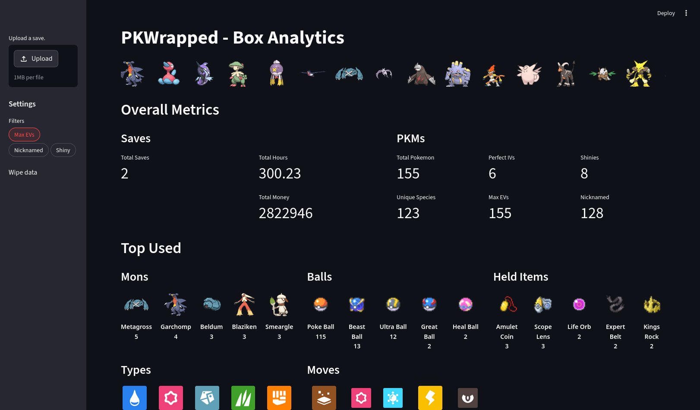
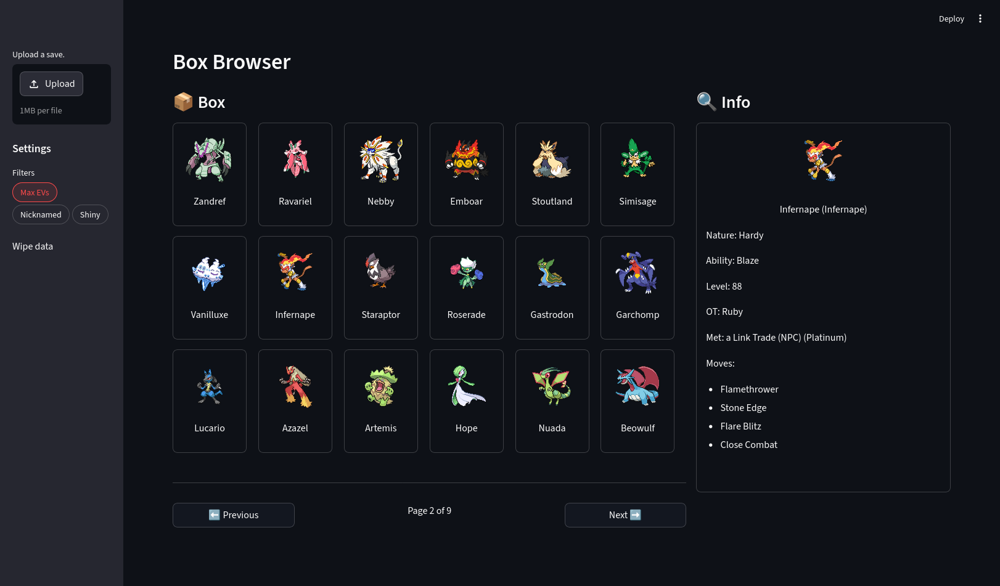

# PKWrapped

Interactive summary statistics for your Pokémon collection.

## Features

- Upload and track PKHex-readable save files.
- Obtain comprehensive insights for your collection - e.g. the number of shines, maxed EVs, and most commonly used species and types.
- Filter your collection to see more granular statistics.
- Browse through your collection and view individual Pokémon with the Box Browser.
- Powered by Streamlit, FastAPI, and SQLite.

## Screenies

  
  

## Setup

The webapp can be spun up with `docker compose`. See the Makefile and Compose for exact commands and ports.

The server requires a [PKBridge](https://github.com/danielkhir/PKBridge) binary and PokeAPI metadata. See [server/README.md](./server/README.md) for more information.

## Credits

- [PKHeX](https://github.com/kwsch/PKHeX) - Core logic for save file parsing.
- [PokeAPI](https://github.com/PokeAPI/) - Sprites and other metadata.
